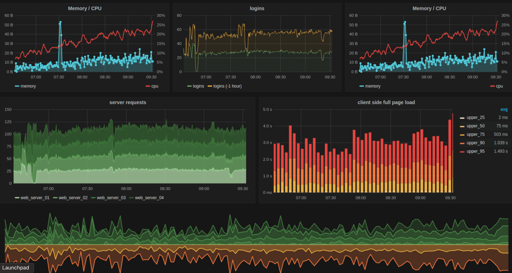

# Time Scope



[](https://gitter.im/timescope)
[](https://travis-ci.org/far20/timescope)
[]()
[](http://www.apache.org/licenses/LICENSE-2.0)

TimeScope is a visualization component for different time series as a combination of line, bar and scater charts, allowing quick analysis of different time series data from sources like perturbations, variance, single-threaded execution, and more.

TimeScope begins by displaying the input data as an interactive subsecond-offset graph. This shows patterns in the data. You can then select a time range to highlight on different patterns, and a flame graph will be generated just for that time range.

## Disclaimer

TimeScope is in early stages of development and under constant change, so bugs and issues are expected. We count on your support to find and report them!

## Installation / Instructions

The quickest way to get started is to run the pre-built client bundle:

```bash
npm install time-scope
```

## Use as a React Component

```jsx
import { TimeScope } from 'time-scope';

const SomeComponent = ()=>{

 return <div>
  <TimeScope data={....} options={...} />
</div>;

}

```
